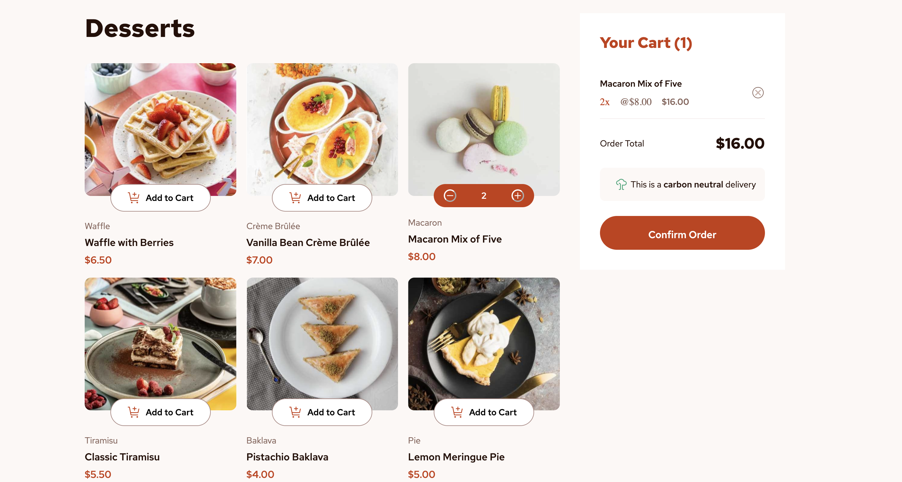
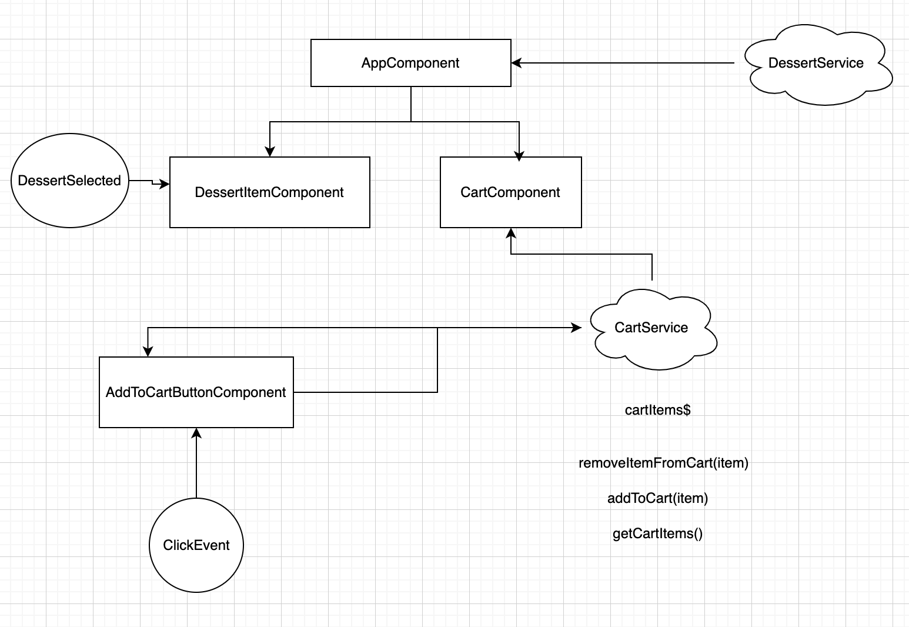

# InvoiceApp

A product list app built with Angular

Live URL: [https://vb-product-list-debugging.netlify.app/](https://vb-product-list-debugging.netlify.app/)

## 📌 Table of Contents

- [🚀 Getting Started](#-getting-started)
- [🛠️ Tech Stack](#-tech-stack)
- [📦 Setup & Run Instructions](#-setup-run-instructions)
- [💻 Running the Application](#-running-the-application)
- [📋 Approach](#-approach)
- [📸 Screenshots](#-screenshots)
- [🚀 Deployment](#-deployment)
- [👤 Author](#-author)

## 🚀 Getting Started

This project is built using Angular, SCSS, Typescript and hosted on Netlify.

## 🛠️ Tech Stack

- Angular
- Typescript
- SCSS
- Jest

## 📦 Setup & Run Instructions

Clone the repository and run the command:

```sh
git clone https://github.com/victorbruce/product-list-debugging
cd product-list-debugging
```

Now, run the command:
`npm install` to install all the dependencies for the application

### Running the Application

#### Development server

To start a local development server, run:

```bash
ng serve
```

Once the server is running, open your browser and navigate to `http://localhost:4200/`. The application will automatically reload whenever you modify any of the source files.

#### Code scaffolding

Angular CLI includes powerful code scaffolding tools. To generate a new component, run:

```bash
ng generate component component-name
```

For a complete list of available schematics (such as `components`, `directives`, or `pipes`), run:

```bash
ng generate --help
```

#### Building

To build the project run:

```bash
ng build
```

This will compile your project and store the build artifacts in the `dist/` directory. By default, the production build optimizes your application for performance and speed.

#### Running unit tests

To execute unit tests with the [Karma](https://karma-runner.github.io) test runner, use the following command:

```bash
ng test
```

## 📸 Screenshots



## 📋 Approach

My approach going into designing and executing this project was heavily based on: **data flow**, **component architecture**, and **component communication**

### 1. Bug Fixes

Approached the project by first resolving bugs and other gliches that affected the app from running and behaving as expected.

### 2. Data Flow, Component architecture, and communication



Mapped out **how data will flow** from one component to the other.

After breaking the initial codebase into smaller reusable components, I realised that using **Input** decorators to accept data from parent compnents and **Output** decorators to emit values from child to parent components wouldn't scale very much. Hence, I opted for the second option which was **Services**.

I decided to create services and inject them into components that needs them using **dependency injection** rather than passing data all the way from the parent or child to components that needed them. This made by codebase clean and I knew exactly where to go to get the needed data from to inject into components.

### 3. Styling

The next step was to fix any UI issues in terms of responsiveness, imagery sharpness,etc. 

## 🚀 Deployment

Netlify

## 👤 Author

Victor Bruce
